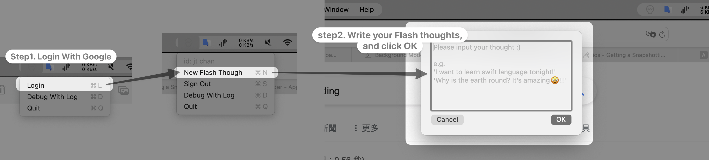
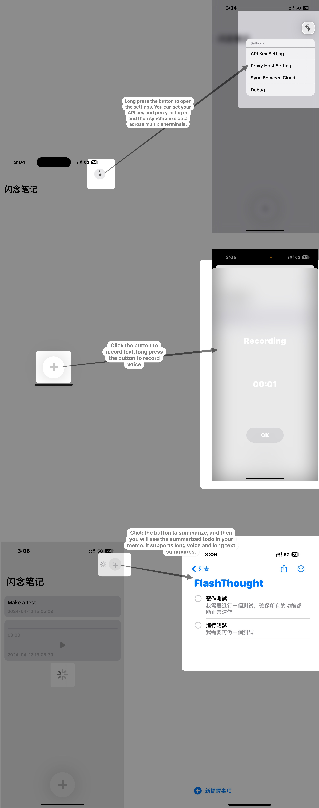

# FlashThoughts

## Introduction

FlashThoughts is a cross-platform application designed for both iOS and macOS that empowers users to effortlessly record their daily thoughts in various formats including text and voice. A notable feature in development is the ability to capture thoughts as images. One of the core functionalities of FlashThoughts is its ability to summarize these recorded thoughts into a to-do list, which can then be integrated into reminders for easy tracking and organization. Supporting Google sign-in, FlashThoughts ensures your data is synchronized across all devices, offering a seamless user experience.

#### MacOS

#### IOS



## Table of Contents

- [Installation](#installation)
- [Usage](#usage)
- [Features](#features)
- [Dependencies](#dependencies)
<!-- - [Configuration](#configuration)
- [Documentation](#documentation)
- [Examples](#examples)
- [Troubleshooting](#troubleshooting)
- [Contributors](#contributors) -->
- [License](#license)

## Installation

### Prerequisites

Before installing FlashThoughts, ensure you have CocoaPods installed on your system as it is required for managing project dependencies. You can install CocoaPods using either of the following methods:

**Using RubyGems:**

```bash
sudo gem install cocoapods
```

**Using Homebrew:**

```bash
brew install cocoapods
```

### macOS

To set up FlashThoughts on macOS, follow these steps:

```bash
cd ./FlashThoughtsMacOS
pod install --repo-update
open FlashThoughtsMacOS.xcworkspace
```

### iOS

To set up FlashThoughts on iOS, follow these steps:

```bash
cd ./FlashThoughtsIOS
pod install --repo-update
open FlashThoughtsIOS.xcworkspace
```

## Usage

After launching the app, you can tap on the "+" button to record a new thought. For voice recordings, simply press and hold the "+" button. To summarize your thoughts into a to-do list, tap the star icon in the top-right corner. Pressing and holding the star icon brings you to the configuration page, where you can set your API key, proxy, and handle login operations.

## Features

1. Multi-platform login support with Google.
2. Synchronized storage across devices with real-time updates.
3. Support for both macOS and iOS platforms.
4. Integration with OpenAI for voice and text summarization (requires an OpenAI API key).

## Dependencies

FlashThoughts relies on CocoaPods for dependency management. Installation instructions for CocoaPods have been provided above, including methods using both RubyGems and Homebrew.
<!-- 
## Configuration

[Detail any necessary configuration steps before using FlashThoughts, including how to obtain and set up an OpenAI API key.] -->
<!-- 
## Documentation

[Location of additional documentation, if available.]

## Examples

[Provide examples or sample code demonstrating how to use FlashThoughts.]

## Troubleshooting

[Describe common issues encountered with FlashThoughts and their solutions.]

## Contributors

[List of people who have contributed to the FlashThoughts project.] -->

## License

FlashThoughts is released under the MIT License. Below is a template for the MIT License text:

```
MIT License

Copyright (c) [2024] [FlashThoughts]

Permission is hereby granted, free of charge, to any person obtaining a copy
of this software and associated documentation files (the "Software"), to deal
in the Software without restriction, including without limitation the rights
to use, copy, modify, merge, publish, distribute, sublicense, and/or sell
copies of the Software, and to permit persons to whom the Software is
furnished to do so, subject to the following conditions:

The above copyright notice and this permission notice shall be included in all
copies or substantial portions of the Software.

THE SOFTWARE IS PROVIDED "AS IS", WITHOUT WARRANTY OF ANY KIND, EXPRESS OR
IMPLIED, INCLUDING BUT NOT LIMITED TO THE WARRANTIES OF MERCHANTABILITY,
FITNESS FOR A PARTICULAR PURPOSE AND NONINFRINGEMENT. IN NO EVENT SHALL THE
AUTHORS OR COPYRIGHT HOLDERS BE LIABLE FOR ANY CLAIM, DAMAGES OR OTHER
LIABILITY, WHETHER IN AN ACTION OF CONTRACT, TORT OR OTHERWISE, ARISING FROM,
OUT OF OR IN CONNECTION WITH THE SOFTWARE OR THE USE OR OTHER DEALINGS IN THE
SOFTWARE.
```